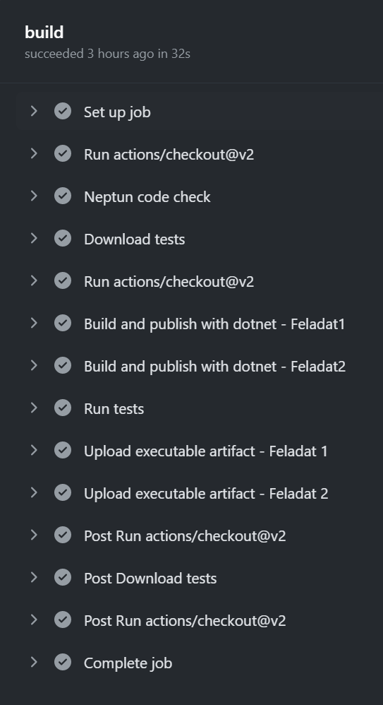

# A házi feladat előellenőrzése és hivatalos értékelése

Minden egyes alkalommal, miután a GitHub-ra push-oltál kódot, a GitHub-on automatikusan lefut egy nagyon egyszerű ellenőrző: megnézi, hogy a neptun.txt ki van-e töltve, illetve van-e fordítási hiba a kódban. A megoldás érdemi ellenőrzését a tárgy oktatói végzik el a határidő lejártát követően.

### A GitHub által futtatott előellenőrzések megtekintése

1. GitHub-on a navigálás a repository-hoz
2. *Actions* tabfülre váltás
3. Itt megjelenik egy táblázat, minden push által futtatott ellenőrzéshez egy külön sor, a tetején van legfrissebb. A sor elején levő ikon jelzi a státuszt: vár, fut, sikeres, sikertelen lehet. A sor szövege a Git commit neve.
4. Egy sorban a commit nevén kattintva jelenik meg egy átfogó oldal az ellenőrző futásáról, ez sok információt nem tartalmaz. Ezen az oldalon baloldalt kell a *"build"* vagy *"build-and-check"* (vagy hasonló nevű) linken  kattintani, ez átnavigál az ellenőrzés részletes nézetére. Ez egy „élő” nézet, ha fut a teszt, folyamatosan frissül. Ha végzett, a csomópontokat lenyitva lehet megnézni az adott lépés kimenetét.  Ha minden sikerült, egy ehhez hasonló nézet látható:

    

5. Itt a legfontosabb talán a *"Run tests"* lépés.
Ha valamelyik lépés sikertelen, pipa helyett piros x van a csomópont elején, és a csomópontot kibontva a teszt kimenete utal a hiba okára.