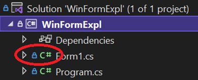
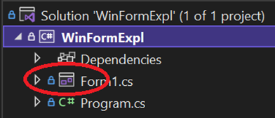

# Windows Forms fejlesztéshez kapcsolódó extra információk

## Rendszerkövetelmények

A házi feladat elkészítése Windows 10 vagy 11 operációs rendszeren, Visual Studio 2022-vel történik. Windows-ra mindenképpen szükség van a fejlesztéhez és az alkalmazás futásához is. Lényeges, hogy a Visual Studio alatt telepítve legyen a ".NET Desktop development” workload (ez a Visual Studio installerben ellenőrizhető/adható meg). Ha valakinek nem áll rendelkezésére ilyen környezet, BME Cloud hozzáférés a tárgyfelelősnél igényelhető.

## Visual Studio designer hiba (ha nem nyílik meg az űrlap szerkesztésre)

A Visual Studio 2022 a Git-ből frissen kiklónozott forrás esetén (amikor még nem létezik egy .csproj.user kiterjesztésű fájl) az űrlapokat  - valószínűsíthetően egy bug miatt – időnként nem hajlandó megnyitni szerkesztő módban (szerencsére ez nagyon ritka). A solution megnyitása után ez esetben ezt látjuk:

A probléma az, hogy a `Form1.cs` előtti ikon (pirossal bekeretezve) nem egy űrlap, hanem egy zöld C# ikon. Ez esetben hiába kattintunk duplán a fájlon, nem az űrlap szerkesztő nyílik meg, hanem csak a forrásfájl. A megoldás ez esetben a következő: a Build menüben válasszuk ki a „Rebuild solution” menüt, majd a Build menüben a „Clean solution” menüt, és várjunk egy kicsit. Ekkor pár másodperc múlva a Solution Explorerben az űrlapunk ikonja megváltozik:

Most már meg tudjuk nyitni az űrlapot szerkesztésre, ha duplán kattintunk a Solution Explorerben a fenti csomóponton.